# Kal-Droid


# Kal-Droid
Introducing our lightweight, lightning-fast, and free Android emulator, designed to provide a seamless experience for developers and enthusiasts alike. Our emulator boasts the latest API support, ensuring compatibility with the newest Android features and developments.
With a focus on efficiency and performance, our emulator offers a smooth user experience without compromising on speed. Whether you're testing applications, debugging code, or simply exploring the Android ecosystem, our emulator provides a responsive environment that mimics real device behavior.

Whether you're a seasoned developer or just getting started, our Android emulator provides the perfect platform to build, test, and explore Android applications with ease. Experience the future of Android development today with our feature-rich and agile emulator solution.

# How To Install:-

# Windows: (tested on Windows-11 64-bit)

### Method 1 (via Windows setup file):

1-First [Download](https://github.com/sudo-subho/kal-droid/releases/download/kal-droid-2.1/Kal-Droid_2.0_X64_WINDOWS_Setup.exe) the setup file. and install

2-Second Set a environment variables named ```ANDROID_HOME``` path to ```C:\Users\[username]\Kal-Droid\android_sdk```

### Method 2 (via python file):

1-First [download](https://www.python.org/downloads/) Python-3 on your PC.

2-Second [Download](https://github.com/sudo-subho/kal-droid/releases/download/kal-droid-2.1/kal-droid.zip) The Zip File and unzip it.

3-Third set an environment variable named ```ANDROID_HOME``` path to your unzip folder after that  ```\android_sdk```. For example ```C:\Users\[username]\Kal-Droid\android_sdk```

4-Fourth, open a PowerShell. ```cd kal-droid``` and ```pip install -r requirements.txt```. After that run the ```main.py``` file ```python3 main.py```

# Linux & macOS:

Coming soon.....

# How To Install a AVD:-

##### Step 1

Go To ```Install Avd``` Tab.
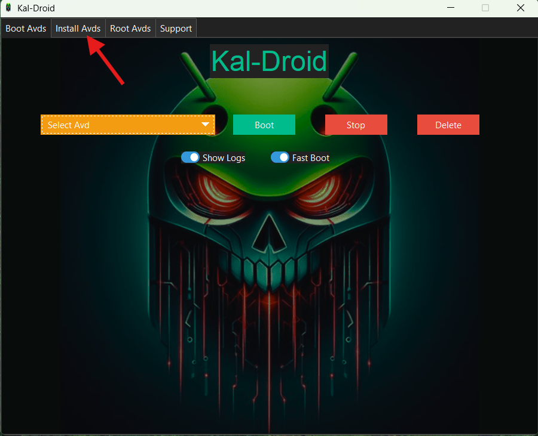

##### Step 2

Click ```Install``` Button. A New Window Pop up
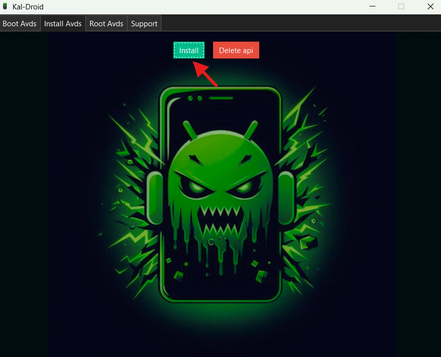

##### Step 3

Select An ```Android API``` and Give a ```Name``` To your AVD and Click ```Install```.
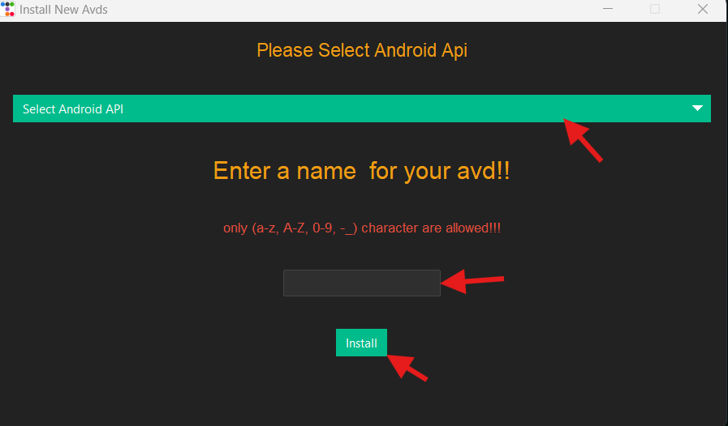

##### Step 4

Please Wait... Downloading And Install your ```Android API```. After completion a window will pop up.
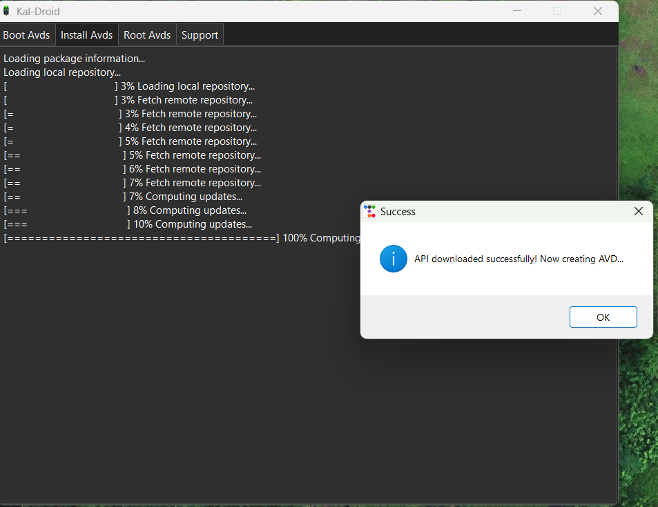

##### Step 5

Please Wait Again.... Creating Your ```AVD```. After completion a window will pop up.
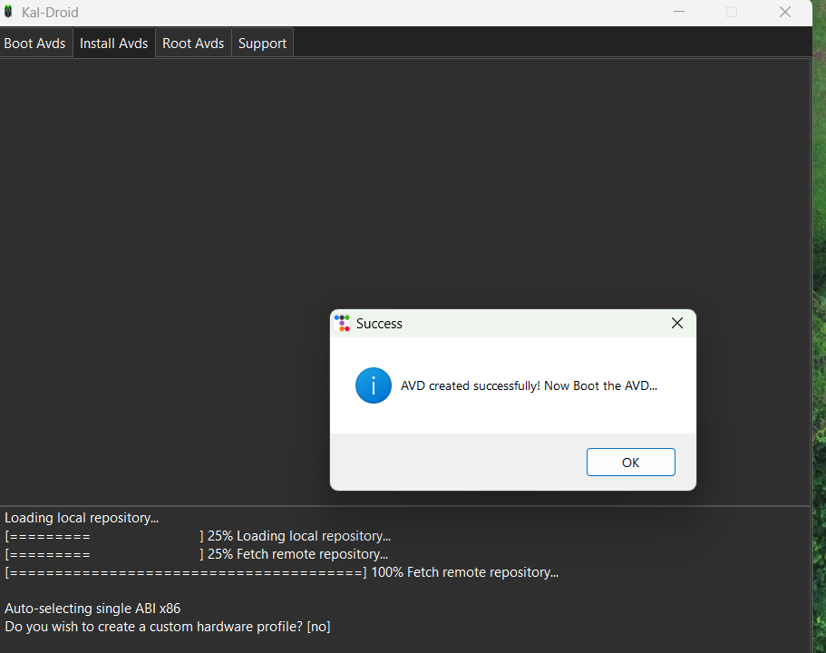

Now Your ```AVD``` is ready to Boot.

# How To Boot:-

Go To ```Boot Avd``` Tab. After that Select Your ```Avd Name``` and Click ```Boot``` Button. 
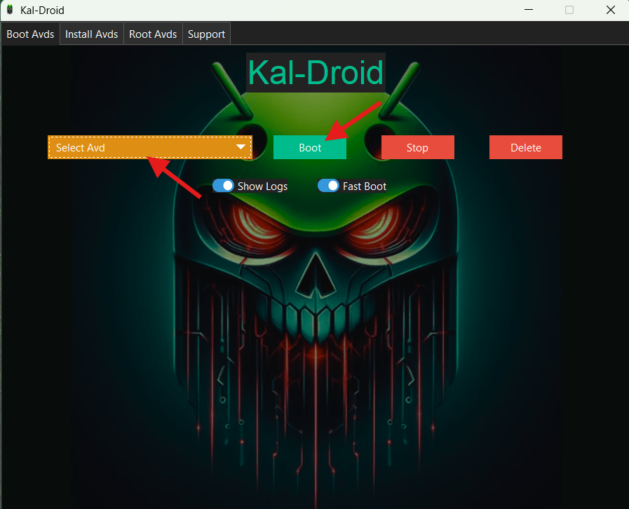

To Stop The ```AVD``` Click ```Stop``` Button.
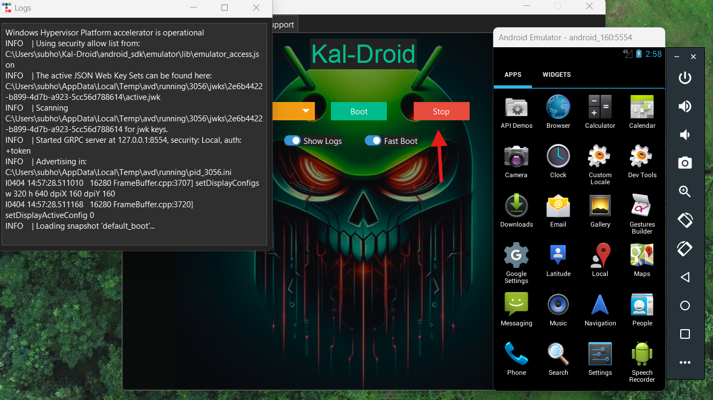

screenshorts/root_avds.png

##### Warning

1-Please make sure That your API is [compatible](https://github.com/newbit1/rootAVD/blob/master/CompatibilityChart.md) with [RootAvd](https://github.com/newbit1/rootAVD). It only supports ```Google PlayStore System Images```

2-Please make sure that ```ANDROID_HOME``` environment variable is set to correct path.

3-Please make sure that the ```AVD``` is running that you want to root.

##### Step 1

Go To ```Root Avd``` Tab. Click ```Root``` Button. Then a New Window Will Pop up.
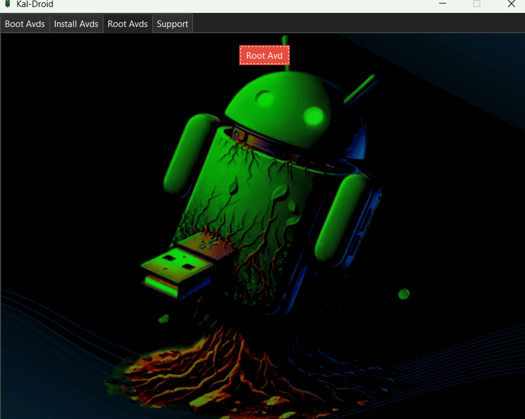

##### Step 2

Select Your ```Android Api``` and Click ```Root Button```.
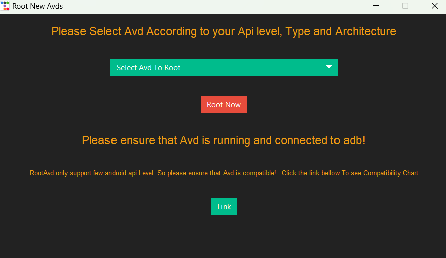

# How To Setup Proxy in AVD:

##### Step 1

First Boot the ```AVD``` and click ```...```. A New Window Will Pop up then Click on ```Settings```. After that go to ```Proxy``` tab.
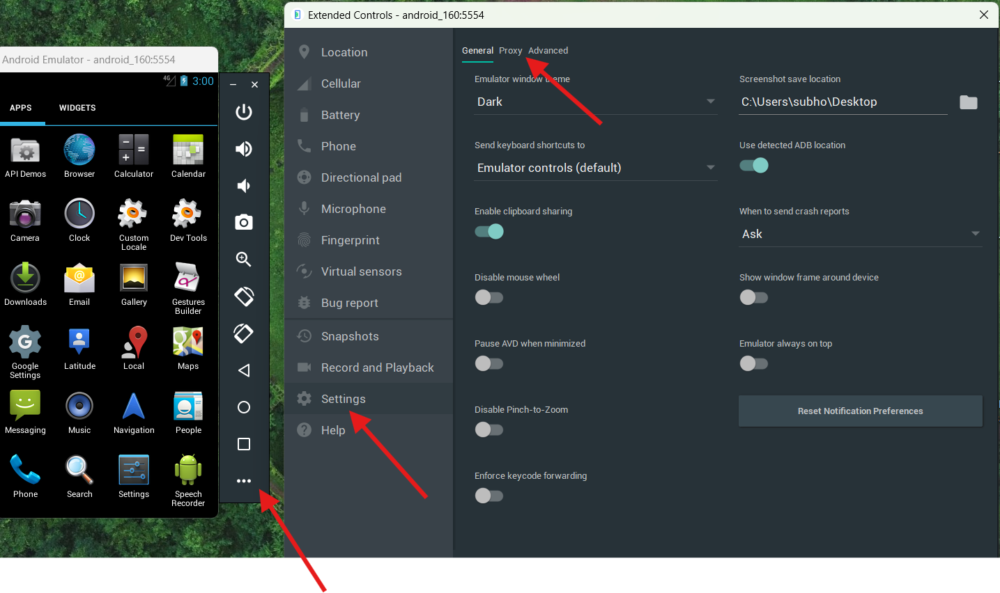

##### Step 2

Uncheck the ```use Android Atudio HTTP proxy settings```. Then Check ```manual proxy configuration``` and then input proxy ```IP``` and ```PORT``` Click ```Apply```. See the ```Proxy Status```.
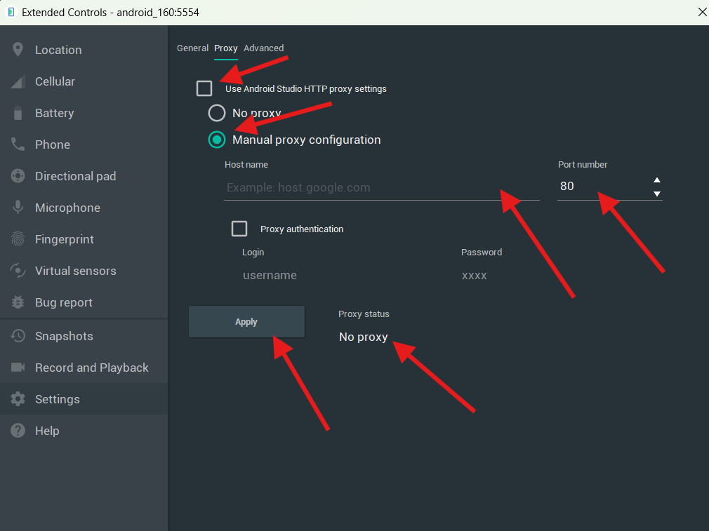

# How To Uninstall AVD and API:

##### Uninstall AVD

Make sure the AVD is Not running. Select The ```AVD Name``` and Click ```Delete``` Button.


##### Uninstall API
Make sure the AVD is Not running. Go To ```Install Avd``` Tab and CLick ```Delete``` Button. A new Window Will Pop up.

